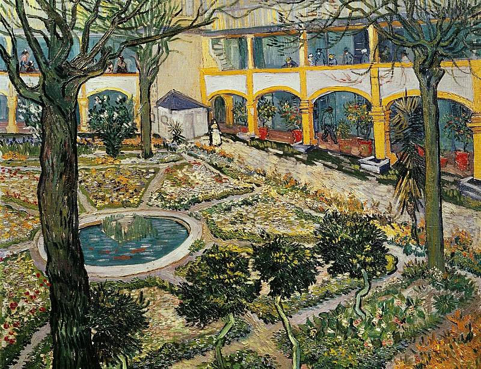

# 收集一些图片作为文章的插图。

[图片站点](https://en.gallerix.ru/album/Vincent-Van-Gogh)

<!-- more -->
## 2019/4/10

> Vincent van Gogh – The Good Samaritan (after Delacroix) 1890

---

## 2019/4/7

> Vincent van Gogh – Self-Portrait with Straw Hat

---

## 2019/2/11

> Vincent van Gogh – Wheat Field with Cypresses

---

## 2018/12/31

> Vincent van Gogh – The Courtyard of the Hospital at Arles

---

## 2018/12/9

> Vincent van Gogh – Thatched Cottages in the Sunshine 1890

---

## 2018/12/2

> Vincent van Gogh – Starry Night

---

## 2018/9/13

> Vincent van Gogh – Olive Trees  1888

---

## 2018/8/17

> Vincent van Gogh – The Drinkers 1890

---

## 2018/8/14

> Vincent van Gogh – Blossoming Almond Branch in a Glass with a Book 1888

---

## 2018/8/3

> Ivan Konstantinovich Aivazovsky – Tower. Shipwrecked 1847

---

> Ivan Konstantinovich Aivazovsky – Wave 1889

---

> Ivan Konstantinovich Aivazovsky – Ninth Wave 1850

---

> Ivan Konstantinovich Aivazovsky – Shipwreck 1864

---

> Ivan Konstantinovich Aivazovsky – Evening In Cairo 1870

---

> Raffaello Sanzio da Urbino) Raphael (Raffaello Santi – Saint George and the Dragon 1503-05

---

> Edvard Munch – The Scream. ver. 1893

---

> Edvard Munch – img742

---

> Edvard Munch – Calvary 1900

---

## 2018/8/2

> Johannes Vermeer – Girl with a Pearl Earring 1665-67

---

> Johannes Vermeer – The Milkmaid 1658-61

---

> Johannes Vermeer – Officer and Laughing Girl 1655-60

---

> Johannes Vermeer – View of Delft 1660-61

---

## 2018/8/1

> Vincent van Gogh – Cafe Terrace in Arles at Night 1888

---

> Vincent van Gogh – The Parsonage at Nuenen 1885

---

> Vincent van Gogh – Canal with Women Washing 1888

---

> Vincent van Gogh – Sunny Lawn in a Public Park 1888

---

> Vincent van Gogh – Old Man in Sorrow 1890

---

> Vincent van Gogh – Noon Rest from (after Millet) 1890

---
