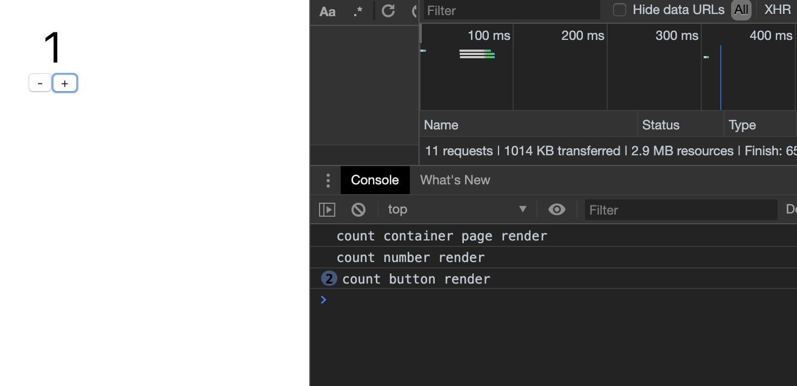
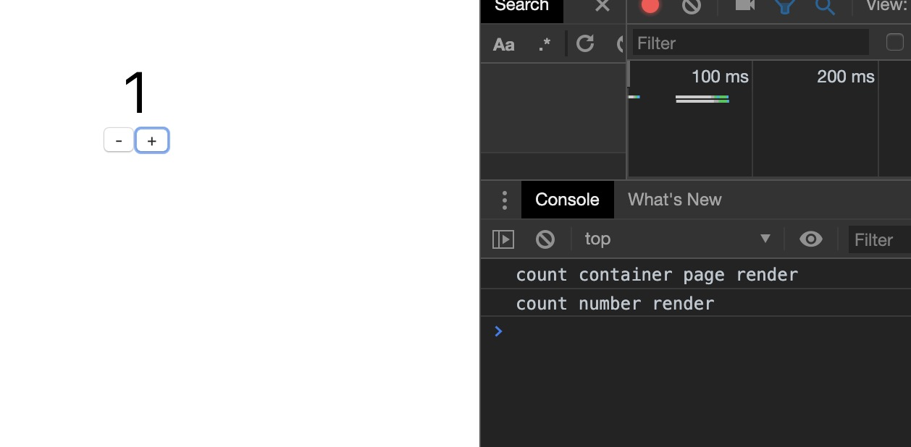
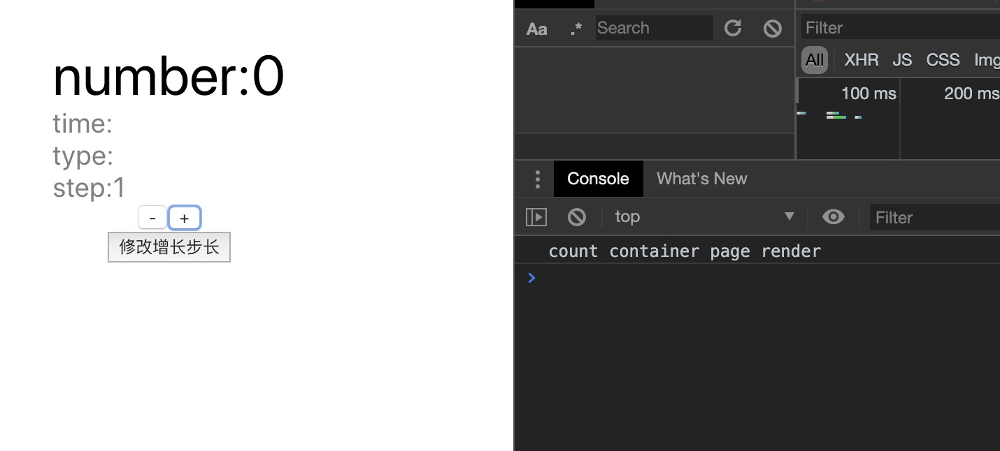
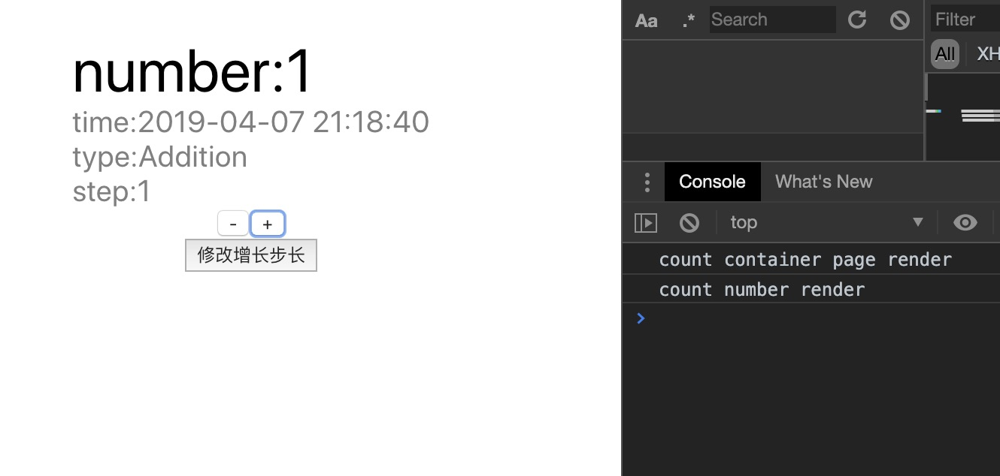

# react 性能优化

为什么需要优化？

> `react` 的子组件在父组件渲染的时候，在默认的情况下，不论这个父组件传递给子组件的`props` 是否发生了改变，这个子组件就会去重新渲染，然后这种渲染是完全没有必要的，所以假想我们的 `react` 工程完全没有去针对这个问题作出优化，只要组件触发了渲染，那么整个子组件都将触发一次渲染，这就会造成性能上的问题。

## 一个 counter 的例子

这里举一个简单的计数器例子来看一下这个问题。

### Counter组件

```jsx harmony
// Counter.js
class Counter extends React.Component {
    state = {
        count: 0
    }
    increase = () => {
        this.setState(state => ({
            count: state.count + 1
        }))
    }
    decrease = () => {
        this.setState(state => ({
            count: state.count - 1
        }))
    }
    render() {
        const { count } = this.state
        console.log('count container page render')
        return (
            <div className={styles.home}>
                <Count count={count} />
                <div>
                    <Button onClick={this.decrease} text="-" />
                    <Button onClick={this.increase} text="+" />
                </div>
            </div>
        )
    }
}
```

### Count组件

依赖于 `Counter` 组件传递 `count` 到这里显示数字:

```jsx harmony
// Count.js
class Count extends React.Component {
    static propTypes = {
        count: PropTypes.number
    }
    render() {
        console.log('count number render')
        const { count } = this.props
        return <div className={styles.count}>{count}</div>
    }
}
```

### Button组件

```jsx harmony
// Button.js
class Button extends React.Component {
    static propTypes = {
        text: PropTypes.string,
        onClick: PropTypes.func
    }
    render() {
        console.log('count button render')
        const { text, onClick: onClickProps } = this.props
        return (
            <button type="button" onClick={onClickProps}>
                {text}
            </button>
        )
    }
}
```

`Counter` 组件下有两个子组件，`Count` 通过 `props` 拿到 `Counter` 组件中的 `state.count` ，给两个 `button` 组件分别加上增加和减少 `Counter` 组件的 `state.count` 的回调函数。同时了方便观察，我分别在三个组件的 `render` 函数中加上了一句打印。

点击增加的按钮之后，观察到组件的渲染情况：



我们发现按钮通过回调函数改变了父组件 `state` 中的 `count` 值，触发了父组件的渲染，同时 `Count` 组件依赖与父组件的 `state.count` ，所以也发生渲染。但是最奇怪的是为什么我的两个按钮都要去重新触发渲染函数呢？这里按钮的渲染是完全没有必要的，如何优化呢？

## shouldComponentUpdate 生命周期

`react` 提供了一个 `shouldComponentUpdate` 就是专门来解决这个问题的。这个生命周期函数就是决定这个组件是否要去渲染，在默认的情况下都是返回的 `true`，都要去重新渲染。这个函数接收两个参数 `nextProps`，`nextState` 方便调用者去判断这个组件是否需要渲染。

这里我们改造一下 `Button` 组件，让他不去做没必要的渲染。

```jsx harmony
// Button.js
class Button extends React.Component {
    // xxx省略
    shouldComponentUpdate(nextProps) {
        const { onClick, text } = this.props
        return nextProps.onClick !== onClick || nextProps.text !== text
    }
    render() {
        console.log('count button render')
        // xxx省略
    }
}
```

结果如下：



`button` 在触发了父组件的渲染后就不再重复渲染按钮组件了, 这是因为传给 `button` 的 `props.text` 和 `props.onClick` 没有发生改变。

我们似乎很容易的解决了这个问题。但是如果稍微修改下 `Counter` 组件给 `Button` 的传参方式如下：

```jsx harmony
// Counter.js
class Counter extends React.Component {
    state = {
        count: 0
    }
    increase = () => {
        this.setState(state => ({
            count: state.count + 1
        }))
    }
    decrease = () => {
        this.setState(state => ({
            count: state.count - 1
        }))
    }
    render() {
        const { count } = this.state
        console.log('count container page render')
        return (
            <div className={styles.home}>
                <Count count={count} />
                <div>
                    {/* 修改这里传参的方式，注意比较上面的传参方式的区别 */}
                    <Button onClick={() => this.decrease()} text="-" />
                    <Button onClick={() => this.increase()} text="+" />
                </div>
            </div>
        )
    }
}
```

结果如下：


哦嚯完蛋，这又回到之前没优化前的状态。这是什么原因导致的呢？这里 `Counter` 组件每次渲染的时候都是重新生成一个新的函数（虽然重新生成的这个函数功能和之前的函数功能是一摸一样的）,函数本质就是对象，是一种应用类型的数据，并非是基本类型数据，所以在 `Button` 内部的 `shouldComponentUpdate` 中比较的时候，尽管这两个函数功能是一样的，但是两个对象比较的是引用地址，所以会让 `Button` 组件以为 `props` 发生了改变，所以会重新渲染。

作为 `Button` 组件来说，即使内部针对渲染做了优化，但是由于外层组件调用者的传参不当同样会造成性能优化失效。

一点衍生：注意到有人喜欢在传参的时候直接去对方法去 `bind(this)` ，比如这样：
```jsx harmony
<Button onClick={this.increase.bind(this)} text="-" />
```
这样也同样也会造成相同的问题。

### React.PureComponent

这是一个官方推出来默认自带 `shouldComponentUpdate` 浅比较的组件，和 `React.Component` 功能相同，可以帮助我们不用手动去写 `shouldComponentUpdate`。但是值得注意的是，PureComponent实现的 `shouldComponentUpdate` 是浅比较的。

```jsx harmony
// Button.js
class Button extends React.PureComponent {
    static propTypes = {
        text: PropTypes.string,
        onClick: PropTypes.func
    }

    static defaultProps = {
        text: '',
        onClick() {}
    }

    render() {
        console.log('count button render')
        const { text, onClick: onClickProps } = this.props
        return (
            <button type="button" onClick={onClickProps}>
                {text}
            </button>
        )
    }
}
```

和上面的 `shouldComponentUpdate` 效果是一样的。

## functional component

我们观察发现，实现渲染优化的方式是使用 `class component` 中提供的 `shouldComponentUpdata` 方法，但是 `functional component` 相对于 `class component` 而言，更加的纯粹、轻量化、简洁明了，只有 `props` 去控制组件的渲染逻辑，那么`functional component` 能否做到渲染优化呢？

> react v16.6 带来了 React.memo

在低于16.6版本一下的 `react` 版本中，`functional component` 实际上是不太能优化渲染方式的，新版本中可以用 `React.memo` 包裹 `functional component` 实现渲染优化。

```jsx harmony
// Button.js
function Button ({text, onClick}) {
    console.log('count button render')
    return (
        <button type='button' onClick={onClick}>
            {text}
        </button>
    )
}
const MemoButton = React.memo(Button)
```

## props 为一个对象时出现的问题

看到上文，是不是以为任何的页面只要加上 `shouldComponentUpdate` 或者直接继承 `PureComponent` 就能直接做到渲染优化呢？答案是当然不能无脑使用 `PureComponent` 了，看我把 `Counter` 组件、`Count` 组件稍加修改如下：

```jsx harmony
// Counter.js
class Counter extends React.Component {
    state = {
        count: {
            number: 0,
            modifyInfo: {
                time: '',
                type: '',
                step: 1
            }
        },
    }
    increase = () => {
        this.setState(state => {
            state.count.number += state.count.modifyInfo.step
            state.count.modifyInfo.time = DateFunction.currentTime
            state.count.modifyInfo.type = 'Addition'
            return {
                count: state.count
            }
        })
    }
    decrease = () => {
        this.setState(state => {
            state.count.number -= state.count.modifyInfo.step
            state.count.modifyInfo.time = DateFunction.currentTime
            state.count.modifyInfo.type = 'Subtraction'
            return {
                count: state.count
            }
        })
    }
    changeStep = () => {
        this.setState(state => {
            state.count.modifyInfo.step = ~~(Math.random() * 10) + 1
            return {
                count: state.count
            }

        })
    }
    render() {
        const { count } = this.state
        console.log('count container page render')
        return (
            <div className={styles.home}>
                <Count countInfo={count} />
                <div>
                    <MemoButton onClick={this.decrease} text="-" />
                    <MemoButton onClick={this.increase} text="+" />
                </div>
                <MemoButton onClick={this.changeStep} text='修改增长步长' />
            </div>
        )
    }
}
```

把原本传给 `Count` 的基本类型的值改为了复合类型，里面放了更多的信息，同时修改 `Count` 组件的 `props` 接收方式为接收一个 `countInfo` 的对象，同时加上了上面所提到的 `PureComponent`，修改如下：

```jsx harmony
// Count.js
class Count extends React.PureComponent {
    static propTypes = {
        countInfo: PropTypes.shape({
            number: PropTypes.number,
            modifyInfo: PropTypes.shape({
                time: PropTypes.string,
                type: PropTypes.string,
                step: PropTypes.number
            }),
        })
    }
    static defaultProps = {
        countInfo: {
            number: 0,
            modifyInfo: {
                time: '',
                type: '',
                step: 1
            },
        }
    }
    render() {
        console.log('count number render')
        const { countInfo } = this.props
        const { number, modifyInfo } = countInfo
        const { time, type, step } = modifyInfo
        return (
            <div>
                <div className={styles.count}>
                    number:
                    {number}
                </div>
                <div className={styles['sub-info']}>
                    time:
                    {time}
                </div>
                <div className={styles['sub-info']}>
                    type:
                    {type}
                </div>
                <div className={styles['sub-info']}>
                    step:
                    {step}
                </div>
            </div>
        )
    }
}
```

结果如下：



点击任何按钮都只会让外层的组件渲染，而不会去渲染 `Count` 组件。**问题就出在我们点击按钮的时候，只是修改了 `state.count` 里面的内容，对于 `state.count` 而言还是相同的引用地址，所以在 `PureComponent` 进行浅层比较的时候发现引用地址是相同的，误以为数据没有发生改变，阻止了 `Count` 组件的渲染。**

### 对象props问题的解决办法

1. 把 `PureComponent` 修改成 `Component`，放弃渲染优化
2. 在 `shouldComponent` 中手动深层次的去比较
3. 组件调用者传递 `props` 下去的时候，每次都是返回一个新的对象

#### PureComponent修改成Component，

我们把 `Count` 继承的 `PureComponent` 换回到 `Component` 继续测试下：



一切都恢复正常。

直接放弃渲染优化的方式在大部分时候还能够接受，但是如果是遇到渲染一个列表，列表中每一项都是一个 `Item` 组件，并且 `Item` 组件接收一个 `data` 的对象去渲染，如果不去控制是否渲染，会出现父组件修改非列表数据重新渲染，进而导致整个列表都进行了没有必要的渲染，这是不能接受的。

#### shouldComponent中手动深层次的去比较

在 `Count` 组件中加上手动比较，直到最后比较的是基本类型的数据。可以发现如果对象嵌套的很深，写这种比较代码是相对繁琐与困难的。

```jsx harmony
// Count.js
 shouldComponentUpdate(nextProps, nextState) {
        const { countInfo } = this.props
        // return false;
        return !(nextProps.countInfo.number === countInfo.number
            && nextProps.countInfo.modifyInfo.time === countInfo.modifyInfo.time
            && nextProps.countInfo.modifyInfo.type === countInfo.modifyInfo.type
            && nextProps.countInfo.modifyInfo.step === countInfo.modifyInfo.step)
    }
```

#### 组件调用者处理

对于 `Count` 组件如果只是采用 `PureComponent` 去比较的话，那么在外层的 `Counter` 组件中在重新渲染的时候需要给 `Count` 组件一个全新引用地址的对象值。修改代码：

```jsx harmony
// Counter.js
increase = () => {
        this.setState(state => ({
            count: {
                number: state.count.number + state.count.modifyInfo.step,
                modifyInfo: {
                    ...state.count.modifyInfo,
                    time: DateFunction.currentTime,
                    type: 'Addition'
                }
            }
        }))
}
```

这样每次 `setState` 的时候都是返回一个全新的对象，从而保证了在需要渲染的时候能够进行渲染，不需要渲染的时候就不会去重复的渲染。

## 总结

1. `PureComponent` 直接使用可以方便的减少重复渲染，需要指出的是这是依据对象浅比较结果判断的，尽量去做渲染优化。
2. 作为组件的调用者来说，在 `jsx` 中，不要写内联函数和内联对象属性，特别是写了内联函数之后，尽管在组件内部已经做了渲染优化但是内联函数和内联对象的属性会导致优化失效。
3. 设计公用组件的时候，尽量让传入的props的值为基本类型的值，从 `antd` 等一些组件库也能发现他们设计的 `props` 基本是扁平化的，很少有传入结构层次很深的对象属性。
4. 在低版本的react中还没有 `React.memo` 方法，所以在某种程度上来说使用 `PureComponent` 是更好的办法

---


> Vincent van Gogh – Self-Portrait with Straw Hat


