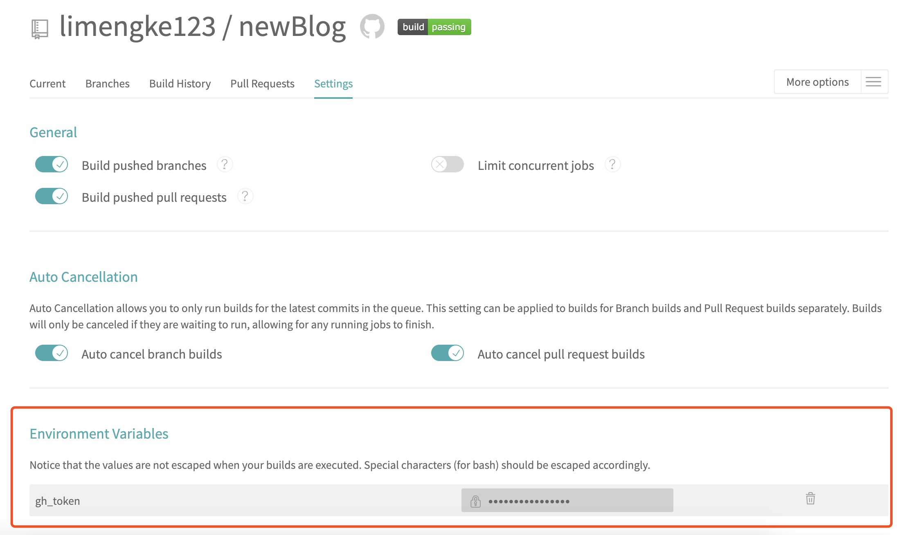
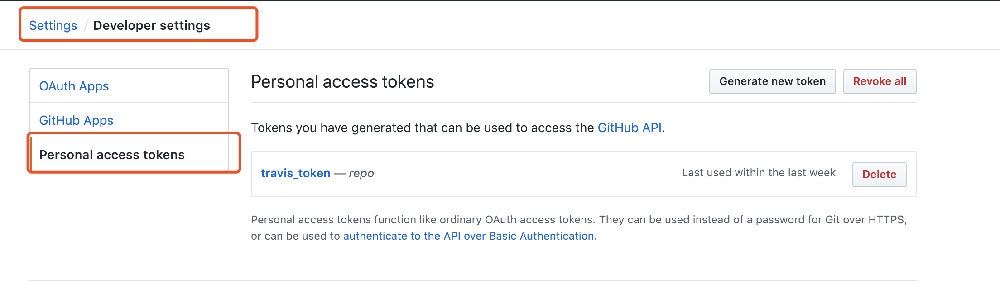
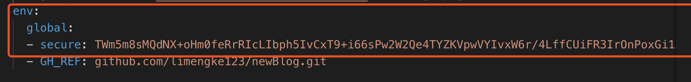
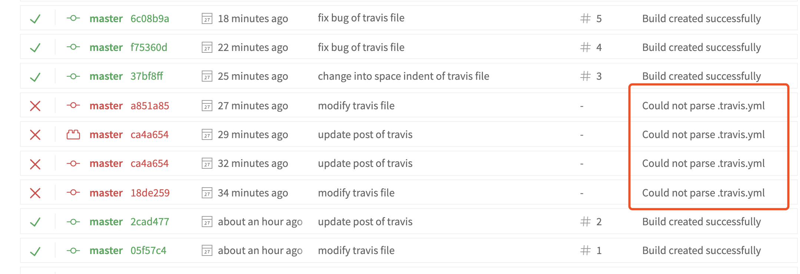

# travis 自动部署hexo博客

`travis` 部署和我们自己手动 `hexo d`有什么区别呢，最主要的区别就是在于 `travis` 能够提供一个虚拟环境，而我们自己去部署的时候需要本机有 `node` 环境，并且要去安装依赖，有了 `travis` 之后，在没有安装这些环境的机子下，只要 `push` 我们的 `markdown` 文件，`travis` 就会自动下载依赖、打包，推送。

## 这个流程做了什么事情

1. 代码推送到 `github` 上，触发了 `travis` 任务
2. `travis` 按照这个仓库中的 `.travis.yml` 文件配置项生成脚本
3. 执行这个脚本

这个脚本一般包括这几个动作，拉取对应仓库的代码，执行`hexo g`生成静态文件，最后 `git push` 到对应仓库上去。

## 如何去做

### 1. 开启travis

用 `github` 登陆[Travis-CI](https://travis-ci.org/)的官网，他会自动拉取 `github` 的仓库列表。开启对应博客的仓库的 `travis` 设置。




需要注意这里有一个环境变量的设置，下面会提到，这里先不用理会。

### 2. 设置token

因为需要在 `travis` 中推生成的静态文件到对应的仓库或是分支，就必须给他 `github` 的 `token` 才能推代码。



这里拿到 `github` 的 `token` ，接下来要传给 `travis`。

`travis` 设置环境变量的方式有两种：

1. 在 `travis` 的网页中填入，正如最上面截图的显示
2. 在 `.travis.yml` 中写入

用方式1写入环境变量是最方便的。

第二种方式中，直接把 `github` 的 `token` 填入到文件中，这样是很不安全的，所以这里需要安装 `travis` 的命令行客户端，生成加密后的 `token`，再把这个 `token` 填入到 `.travis.yml` 文件中。

#### 生成加密的token

如果是直接在 `travis` 网页中填写，这里可以忽略。

这里需要有 `ruby` 环境，同时用 `ruby` 的包管理器 `gem` 去安装 `travis`

```bash
# install travis
gem isntall travis

# 用github账号登陆travis
travis login --auto

# 生成加密后的token
travis encrypt 'REPO_TOKEN=<TOKEN>' --add
```

> 注意这里`REPO_TOKEN`就是环境变量。
> --add 会自动把环境变量写入到 `.travis.yml`文件中，所以事先在项目中写一个 `.travis.yml` 文件
> 如果 `add` 失败，注意查看 `.travis.yml` 文件内容是否格式有问题



### 3. 写一个.travis.yml

```yml
language: node_js
node_js: stable
branches:
- only: master
install:
- npm install
before_script:
- git config --global user.name "yourname"
- git config --global user.email "youremail"

script:
- hexo clean
- hexo generate
after_script:
# - hexo deploy
  - cd ./public
  - git init
  - git add .
  - git commit -m "Travis-CI update docs"
  - git push --force https://${REPO_TOKEN}@${GH_REF} master:gh-pages
env:
  global:
  - secure: 自动生成的，其实对应的就是REPO_TOKEN，如果在travis页面内设置了token的环境变量，这里是没有的
  - GH_REF: github.com/xxx/xx.git 你想要推送的静态文件地址，用https协议
```

`branches` 设置 `only` 为 `branch` 为 `master`，这样只有这个仓库的 `master` 分支发生了变化，`travis` 才会触发，因为我的博客项目仓库和静态文件都是在一个仓库，只是在不同的分支，所以这个选项很有必要。最后推送的时候，https://${REPO_TOKEN}@${GH_REF}这样就把token带过去了，所以就能推文件到仓库里了。

## 总结

最后 `push` 下代码，就会在 `travis` 中生成一个任务，去完成一整套的部署任务了。

特别需要注意的地方是 `.travis.yml` 文件的格式一定要正确，我在几个空格的地方用了制表符，结果导致一直失败。这时候观察到 `travis` 的 `requests` 中就能发现到是因为这个 `yml` 文件的格式出现问题。

