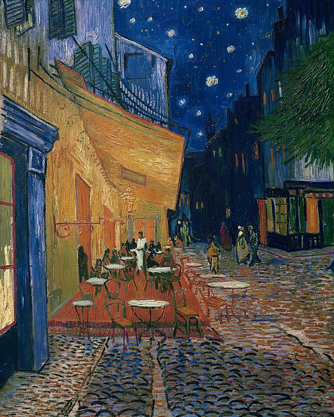

折腾了一天,终于用 `hexo` 搭出来博客了,一开始上手的时候感觉很简单,应该小半天就能把原来的文章迁移过来，结果还是遇到了不少的坑。中途在 `gitee` 和 `github` 上来回折腾，`github` 实在是太卡了，无形中增加了不少搭建的时间。所幸，最终还是弄好了，下一步就是把之前写在另一个仓库下的文章迁移过来了。

`hexo` 最大的方便就是完成了基本的配置和主题的选择之后，只要专心写好 `markdown` 就好了，文章页面就交由 `hexo` 处理即可，大大提升对文章本身的专注力。

最后还是要说一句：“你好，世界！”

---

> Vincent van Gogh – Cafe Terrace in Arles at Night 1888
