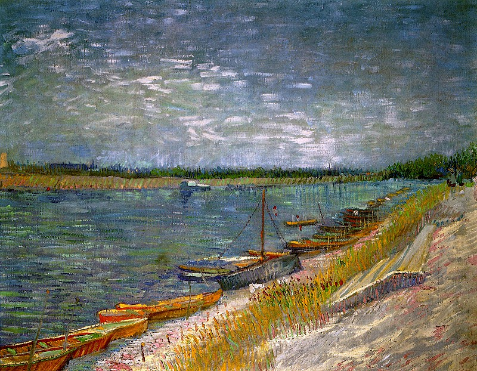

# 关于习惯

我是一个普通的不能在普通的人，也就这样平凡地度过了这么二十多年。当我回首这二十余年的成长经历，好像没什么值得提起的。正当今年的某一天的夜里，我好好想了想，人生还这么长我不能继续这样下去了。我觉得我应该去做一些改变，去改变目前平淡无奇且无味的生活。

从一本调侃性质的书名 *21天精通java* 受到启发，我应该去尝试做一些我没做过的事，或者是去坚持一些我曾经做过却放弃的事情，至少去做够 **21** 天。21天刚好是习惯将要养成的时间节点，这个节点去观察坚持了21天这件事是否有达到目标期望值。21天之后可以选择继续坚持或者是放弃，一开始选择做某件事总是冲动的，有时候趁早放弃也不是一件坏事。当然了，一件有意义的事情能够继续坚持下去那是更好不过的了。

所以尝试去做一系列21天小计划。

## 21天小计划目的

* 空白的生活增加一些有意义或者好玩的事情
* 修养与自我

## 21天小计划原则

1. 尽可能是有积极性，减少无意义的习惯，时间宝贵
2. 尽可能便宜，钱太难赚
3. 断舍离要果断，21天试错的时间成本已经够多了
4. 坚持再坚持，21天只是个开始

## 21天小计划立项

出于断舍离的考虑，或是自身毅力的不够，或是其他非可抗因素，目前立项非常有可能被中断。

### bilibili的21日禁断计划

短视频冲击了我们的生活，这种奶头乐似的短暂快乐麻痹了我们。bilibili打碎了我完整的时间，然后把碎片时间一点点从我的生命中抽离走，虽然之前多次尝试过，多以失败告终，这里再次重启禁断计划。

* 2019/10/10 不看b站的第0天

### 室内无器械健身计划

2019年的9月份已经开始。

### 护肤计划

预计2019年双十一活动之后开启。

### 日语21天学习计划

主要本来就有两本日语教程书，不学就浪费了，预计2019年10月中旬重新开启。

## 未来展望

* 去尝试看足球比赛，当一只球队的粉丝比如*巴塞罗那*
* 多听摇滚乐，有时间有钱包有机会可以去现场
* 减少娱乐消磨的垃圾时间，不看没意义电视剧、电影
* 有空多看书，经济实在
* 技术上横向发展，做一些特定领域的21天学习计划，如之前的 *21天学习java*
* 或许有一个早睡计划比较合适
* emmm那就应该有一个早起计划来充分利用好每一天

---

> Vincent van Gogh – View of a River with Rowing Boats