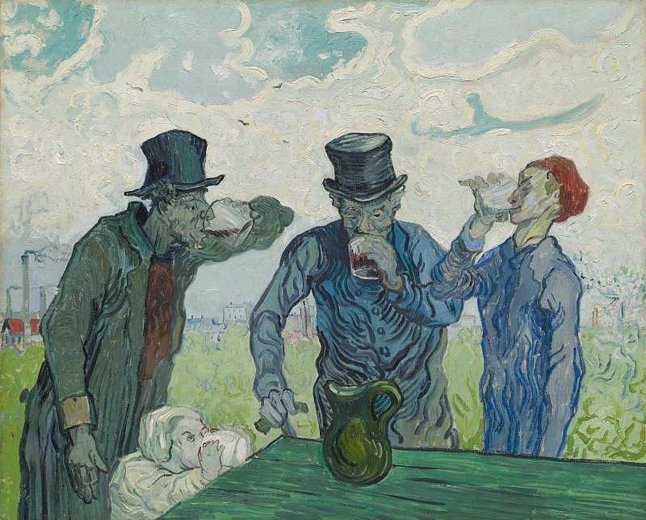

# 记录一些题目

## 2018/8/16

实现一个 `transform` 方法把一个对象的 `key` 从驼峰的形式转换成 `_` 的形式。举个例子：

```js
let obj = {
  newUserInfo: {
    newBook: [
      1,
      2,
      {
        userInfo: 2
      }
    ],
    w: 2
  },
  isURL: {
    heyTTT: "dhsajk"
  }
}

transform(obj)

/**
 * {
 *   new_user_info: {
 *      new_book:[
 *        1,
 *        2,
 *        {
 *          user_info: 2
 *        }
 *      ],
 *      w:2
 *   },
 *   is_url: {
 *     hey_ttt: "dhsajk"
 *   }
 * }
 *
*/

```

需要注意一下，递归对象、和数组都要考虑，同时出现 `isURL` 这种连续大写的也要考虑。当时在纸上手写了大概五六分钟，还行，不太难：

```js
const transformKey = key => {
  const reg = /([A-Z]+)/g
  return key.replace(reg, (_, a) => {
    return `_${a.toLowerCase()}`
  })
}

const isObject = obj => {
  return Object.prototype.toString.call(obj) === '[object Object]'
}

const transform = obj => {
  return Object.keys(obj).reduce((accu, current) => {
    let value = obj[current]
    if (isObject(value)) value = transform(value)
    if (Array.isArray(value)) value = transformArray(value)
    current = transformKey(current)
    accu[current] = value
    return accu
  }, {})
}

const transformArray = arr => {
  return arr.reduce((accu, current) => {
    if (isObject(current)) current = transform(current)
    if (Array.isArray(current)) current = transformArray(current)
    accu.push(current)
    return accu
  }, [])
}
```

---

解析 `url` 参数，出场率还挺高，和上面差不多：

```js
const getParams = function (url) {
    let [url, paramsString] = url.split('?')
    return paramsString.split('&').reduce((accu, current) => {
        let [key, value] = current.split('=')
        if(accu[key]) {
            if(Array.isArray(accu[key])) {
                accu[key].push(value)
            } else {
                let temp = accu[key]
                accu[key] = [temp, value]
            }
        } else {
            accu[key] = value
        }
        return accu
    }, {})
}
```

---



> Vincent van Gogh – The Drinkers 1890