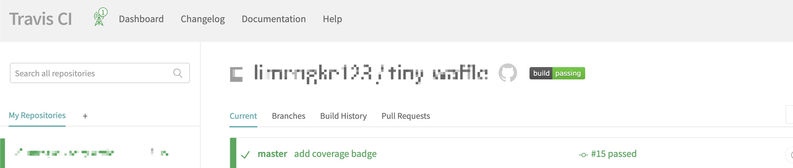
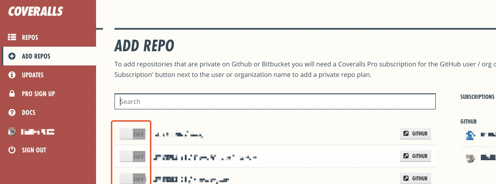
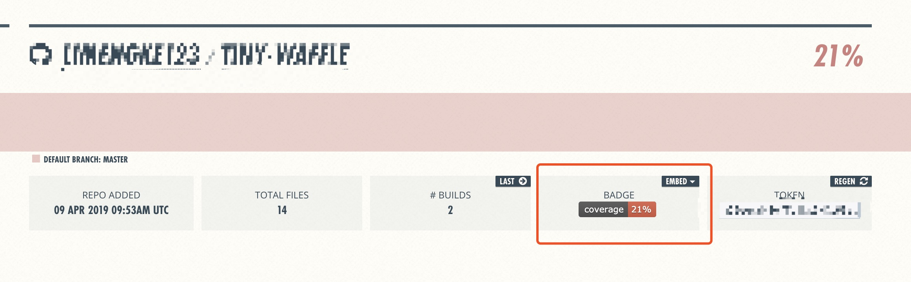
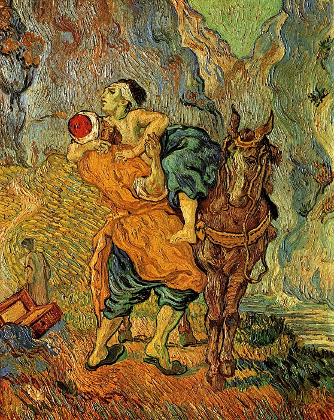

# 给readme加上徽章

很多开源项目的 `readme.md` 文档写的相当漂亮，特别是加上了一些徽章之后能够很显眼让别人一眼看到这个 `repo` 的一些特点。这里介绍下如何给一个仓库加上徽章。

## 静态徽章

所谓静态徽章就是放到仓库之后不用管它了，它的样子也永远不需要发生改变。静态徽章可以在 [shields.io](https://shields.io/) 去自定义生成一些。比如：


在网站上定义好，配置好样式参数，就能拿到一个图片链接，把链接加入到 `readme.md` 中就行了。

## 动态徽章

动态徽章就是会根据仓库改变而自动改变的徽章。

### building 


要求就是仓库能够关联 `ci` ，这里以 `travis.ci` 为例，在用 `travis.ci` 加入自动部署之后，`travis.ci` 会给你一个 `build` 状态的徽章，这个徽章会在成功部署之后变成 `building pass` ，在部署失败之后徽章就会变成 `building fail`。



拿到这里的徽章链接，挂到 `readme` 上面。

### coverage


想要动态获得测试代码覆盖率的徽章，这里除了 `travis.ci` 自动构建之外还需要另外一个网站提供这个动态徽章的功能。可以使用 [coveralls](https://coveralls.io/)，还有同类品 [Codecov](https://codecov.io/)。这里以coveralls介绍下。

整个流程是这样的：

1. 代码推送到 `github`
2. `github` 触发 `travis.ci`
3. `travis.ci` 去打包部署，同时触发项目的单元测试，生成覆盖率报告
4. `travis.ci` 触发 `coveralls`，将覆盖率报告推送给 `coveralls`
5. `coveralls` 接受覆盖率报告生成对应覆盖率的标签

具体做法：

1. 在项目中安装 `coveralls`，安装这个包是为了 `travis.ci` 能够方便地将生成好的覆盖率报告推送给 `coveralls`。

```bash
# or npm install coveralls --save-dev
$ yarn add coveralls --dev
```

2. 在 `package.json` 中加入一句 `scripts`，` "coverage:ci": "react-scripts test --coverage --coverageReporters=text-lcov | coveralls" `，注意这里用的是create-react-app的脚手架，所以是react-scripts，如果是一般的项目那就用 ` "coverage:ci": "jest --coverage --coverageReporters=text-lcov | coveralls" `。这条命令的意思是生成报告并传给coveralls这个包，由它去发给coveralls这个网站。

3. 在 `travis` 的配置文件 `travis.yml` 的 `script` 中加入一句:

```yaml
script:
  # 其他的一些操作 比如打包
  - yarn coverage:ci
```

4. 去 [coveralls](https://coveralls.io/) 网站开启配置，给需要的仓库勾选上开启。



5. 触发推送一次之后，就能在 `coveralls` 中发现已经生成了覆盖率的图标：

，拷贝这个图标到 `readme.md` 就成功了。

---



> Vincent van Gogh – The Good Samaritan (after Delacroix) 1890
