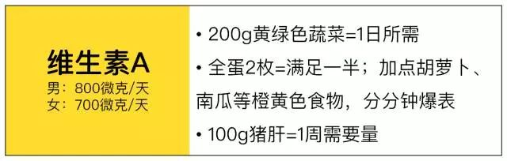
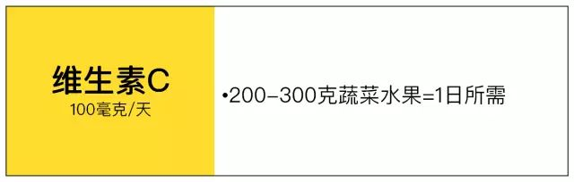

# 维生素指北

有很长一段时间没更新博文了，一个原因是比较忙，另一个原因就是最近的身体状态不太好。这个夏天竟然连续地感冒了两次，今天还有牙疼、口腔溃疡在折磨着。几次折腾下来，也花了不少钱，所以还是得找一些办法增强抵抗力。

前段时间看到知乎一些关于维生素的介绍，便宜又有效，感觉还是比较符合我的心里预期。当然最好的健康养生方式是良好的作息以及均衡的饮食习惯。饮食习惯我倒没有非常挑食，最近泡面买来我也很少吃了，因为泡面这玩意儿*钠*含量是真的高，一包下来基本有个 *2000mg* 了，一个人一天建议摄入量也差不多是这么多。所以泡面、高盐量的食品还是要少吃，*钠*摄入太多了，对血压什么的影响都很大。另一个点，我倒是很少吃水果，一来不太喜欢出去买水果，二来现在的水果也不太便宜，同时我也没冰箱，很能储存水果。仔细想想，好像上一次吃水果的时候还是好几个月之前。

这两天牙龈肿疼地我睡不着觉，买了药就花去了五十多。查了一些资料，以及结合自身的症状对比，感觉我可能因为是长期没吃水果，身体缺少了维生素C，所以本篇结合一些别的文章，总结下怎么补充维生素。

## 维生素分类

### 维生素A

> 长期用眼。

维生素A缺乏，会带来眼睛干涩，夜间视力下降等问题。

### 维生素C

> 果蔬没吃够的

### 维生素D

> 太阳晒的少，影响钙吸收

### 维生素B

B类的维生素有很多种。

#### 硫胺素(维生素B1)

运动越多，消耗能量（主要是碳水化合物）越多，硫胺素需要也越多。随着进食量增加，硫胺素摄入可能也会增加，**所以一般不必额外补充。**

#### 核黄素（维生素B2）

核黄素跟蛋白质、脂肪、碳水化合物的能量产生都有关系。我国目前是成年男性1.4毫克/天，女性1.2毫克/天。运动人群，增加到推荐量的1-2倍足矣。食物补充的话，平时可以多吃肉、蛋和奶制品。花椰菜、芦笋、菠菜这类绿色蔬菜核黄素含量也比较高。**这些东西吃的少的话，可以考虑补充剂。**

#### 烟酸（维生素B3）

烟酸跟蛋白质、碳水化合物、脂肪的能量产生都有关。含烟酸比较丰富的食物有肉类、谷类、豆类食物。因为色氨酸在体内能转化成烟酸，动物蛋白摄入比较多的人，**烟酸一般都不会缺乏**。所以，常吃较多肉的人，即便是运动人群，也基本不用额外补充烟酸。

#### 维生素B6

这种维生素主要跟糖原和蛋白质代谢有关。体内储存的糖原想变成葡萄糖，氨基酸想转换利用，都需要维生素B6，所以这东西跟运动关系密切。

维生素B6跟别的B族维生素不一样，这玩意有毒性。但一般都要达到药物剂量才会中毒。比如治疗经期按综合症、哮喘有时会用到B6。维生素B6的最高耐受上限是100毫克/天。低于这个剂量一般没有太大问题。

比较安全的补充方式还是食物，肉、蔬菜、坚果、香蕉、全谷物食品里含B6都很丰富。比如100克鸡胸肉里就有大约0.6毫克维生素B6。所以，这些东西吃的比较多的话，一般不用吃补充剂额外补充。

## 选择

考虑自身的一些条件，我最后还是考虑先买点维生素C和维生素B2以及维生素B6。