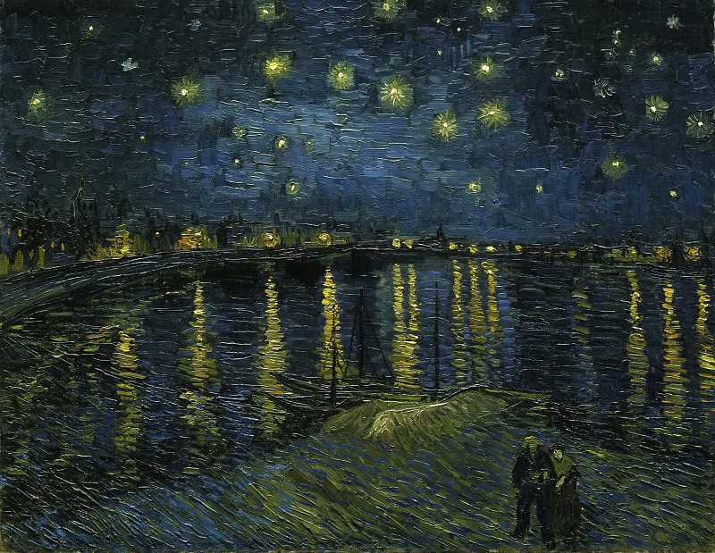

# 阴天

今天很难得，在一个清闲的周日下午，外面开始才起来了雨。我是喜欢下雨的，特别是在非常平静的时候，能躺在床上，没有什么烦心事，就是很安静地去听窗外的雨滴声。窸窸窣窣的声音，着实是让人着迷啊，此刻任何的音乐只会破坏了此刻的宁静。陌生的年轻人们，倘若你曾今或是现在很不喜欢雨天，在一个没人的时候，没有其他扰心事的时候，闭上眼睛，忘记所有的色彩，只留下黑白灰，点点滴滴，单调重复的雨滴敲击声足以让你畅想一切，忘乎自我。那个时候，你可能才能体会此刻我平静的心情。

已经很久没有去写东西了，也曾偶尔想过抽空写一些，但总是被自己假托工作太忙而推辞。但正如此刻，想要把三个月空闲未起笔的期间所发生的事情以及一些想法记录下来，又突然无从说起，那就随便说说，想到什么就写一些什么吧。

世界上所有的雨滴，没有一滴是相同的，也没有一个人在性格、行为表现上是相同的。以前我没得选择，现在我想做一个有趣的人。不晓得诸位年轻的陌生人有一些什么样的爱好呢，审视我自己，我从茫茫普通人，最后也还是走向茫茫的普通人，好像也没什么想法和爱好，这当然不好。从人性的本质上来说，欲望是人动力的根源。人还是很奇怪，有时候会去想表现出自己、突出自己，摆脱平凡普通人的标签，做一个不普通的普通人，有时候也会出现隐藏自我、保护自我的普通化自己，尽可能的让自己变得像个普通人，去除多余自认为无意义、价值的属性。

前几日看到这片住的地方快要拆迁了，大大的横幅上写着 `2018.12.31` 前要腾空结束，看来这边所能居住的时间要开始倒计时了，虽然我还没有问过房东是否要搬走的事情，但我想，待在这边的时间真的不多了。我还是挺烦搬家的一个人，刚来杭州就是住的这里，虽然是个农民房，但是讲道理地理位置还是很不错的，价格也相当公道。虽然住在五楼，原来经常出现水很小，小到几乎停水的状态，原来冬天洗澡经常出现肥皂涂满身体，水却突然停了，只能蹲在地上，祈求水赶紧来的情况，不过好在我这人和普通人有一点不一样，我不会特别怕冷，所以也还凑合吧，虽然有不少毛病，住习惯了，多少也有点感情嘛。

近来学习又有目标了，感觉也是比较开心的事情，知道应该去做一些什么。现在的年轻人，特别是互联网行业的人，焦虑是少不了的。如何减少焦虑，看来也只有去不停学习和追赶，这种焦虑某种程度上来说也不是坏事，毕竟整个社会就是很残酷，做好自己，提升自己才能，少一些迷茫和焦虑。

雨越来越大，我又在胡言乱语了，中午没有睡觉，此时的雨声让我多少有些迷糊。你我都知道，没有不会停的雨，不是此刻，也不是即将来到的下一刻，只是在未知的某一个时间点，自然而然的就会停。陌生的年轻人，如果此刻，你没有焦虑，没有烦恼，恰巧又是躺在床上，闭上眼睛去听一听雨的声音吧，也许下一刻，雨就停了。

---

> Vincent van Gogh – Starry Night
